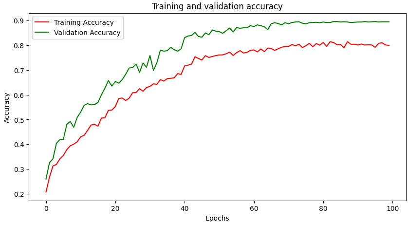
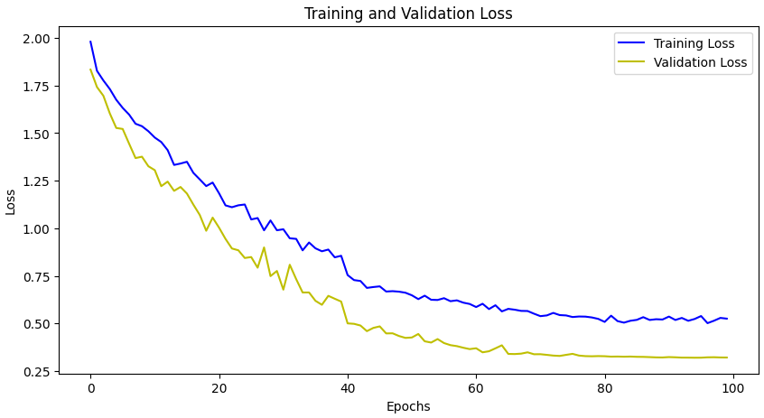
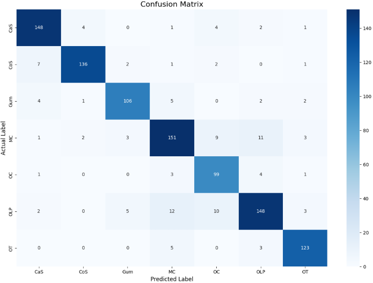
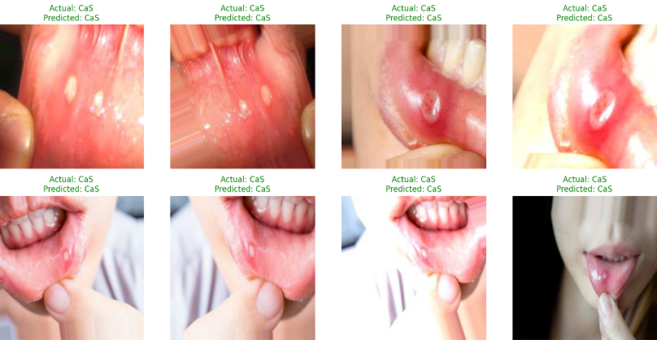

# Teeth Classification using Convolutional Neural Networks

 <!-- Optional: Create a banner image -->

[](https://www.python.org/downloads/)
[](https://www.tensorflow.org/)
[](https://opensource.org/licenses/MIT)

A deep learning project to classify dental images into seven different categories using a custom-built Convolutional Neural Network (CNN) in TensorFlow and Keras. This repository includes the full workflow from data preprocessing and model training to evaluation and prediction.

---

## Table of Contents
- [Project Overview](#project-overview)
- [Key Features](#key-features)
- [Dataset](#dataset)
- [Model Architecture](#model-architecture)
- [Results & Evaluation](#results--evaluation)


---

## Project Overview

The goal of this project is to accurately classify images of human teeth into distinct categories. The model is trained on a dataset of dental images and can identify classes such as 'CaS', 'CoS', 'Gum', 'MC', etc. This project demonstrates the effectiveness of CNNs for medical image analysis and compares a baseline model against a model enhanced with data augmentation to prevent overfitting and improve generalization.

---

## Key Features

- **Custom CNN Architecture**: A sequential CNN model built from scratch using TensorFlow/Keras.
- **Data Augmentation**: Implementation of `RandomFlip`, `RandomRotation`, and `RandomZoom` to create a more robust model.
- **Performance Evaluation**: Detailed model evaluation using accuracy, loss, classification reports, and confusion matrices.
- **Callbacks**: Use of `EarlyStopping` and `ReduceLROnPlateau` for efficient training.
- **Single Image Prediction**: A function to classify a single, new tooth image.

---

## Dataset

The model was trained on the "Teeth Dataset", which is organized into three subsets: Training, Validation, and Testing. The dataset contains **7 classes** of dental images.

- **Training Set**: 3087 images
- **Validation Set**: 1028 images
- **Test Set**: 1028 images

---

## Model Architecture

The final model (`teeth_cnn_2`) includes data augmentation and consists of the following layers:
1.  **Input Layer** (256x256x3)
2.  **Rescaling Layer** (Normalization)
3.  **Data Augmentation**
4.  **Conv2D Block 1**: 32 filters, (3,3) kernel, ReLU activation + MaxPooling2D
5.  **Conv2D Block 2**: 64 filters, (3,3) kernel, ReLU activation + MaxPooling2D
6.  **Conv2D Block 3**: 128 filters, (3,3) kernel, ReLU activation + MaxPooling2D
7.  **Flatten Layer**
8.  **Dense Layer**: 128 units, ReLU activation
9.  **Dropout Layer**: 0.5 rate
10. **Output Layer**: 7 units, Softmax activation

---

## Results & Evaluation

The model with data augmentation achieved a test accuracy of **89%**. The training history and evaluation metrics are visualized below.

### Training and Validation Performance

The plots show that data augmentation helped in reducing overfitting, leading to a smaller gap between training and validation accuracy/loss.




### Confusion Matrix

The confusion matrix shows the model's performance on the test set for each class.



### Prediction Examples

Here are some examples of the model's predictions on the test set. (Green = Correct, Red = Incorrect)



---

## Setup & Installation

Follow these steps to set up the project environment. This project is best run in a Google Colab environment to leverage GPU support and easy integration with Google Drive.

**1. Clone the repository:**
```bash
git clone https://github.com/your-username/teeth-classification-cnn.git
cd teeth-classification-cnn
```

**2. Set up the Dataset:**
- Download the dataset and place it in your Google Drive.
- Ensure the folder structure matches the one described in the [Dataset](#dataset) section.

**3. Install Dependencies:**
It is recommended to use a virtual environment.
```bash
python -m venv venv
source venv/bin/activate  # On Windows, use `venv\Scripts\activate`
```
Install the required packages:
```bash
pip install -r requirements.txt
```

---

## Usage

**1. Open the Notebook:**
- Upload the `notebooks/teeth_classification.ipynb` file to your Google Colab or open it locally in Jupyter.

**2. Mount Google Drive (if in Colab):**
- The notebook will prompt you to mount your Google Drive to access the dataset.

**3. Update File Paths:**
- In the notebook, update the `zip_dir` and `main_dir` variables to point to the correct paths in your Google Drive.

**4. Run the Cells:**
- Execute the cells sequentially to preprocess the data, build the models, train them, and see the evaluation.

**5. Saved Model:**
The trained model (`teeth_classification_model_with_augmentation.keras`) is saved to Google Drive. You can load this model for future predictions without retraining.
